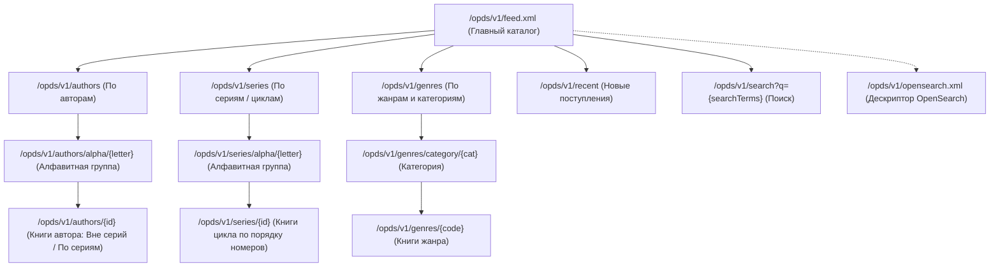

# План реализации проекта Next-Gen OPDS Suite (Boyan) — Этап 2: OPDS v1.2 & OPDS v2.0

## 1. Обзор задачи и цели этапа

Цель **Этапа 2** — превратить ядро бэкенда в полноценный, высокопроизводительный сервер каталогизации и дистрибуции электронных книг по двум протоколам:
1. **OPDS v1.2 (Atom/XML):** 100% совместимость с AlReaderX, KOReader, PocketBook Cloud, FBReader, Moon+ Reader, KyBook.
2. **OPDS v2.0 (JSON-LD):** поддержка читалок нового поколения по спецификации Readium OPDS 2.0 (Thorium Reader, Cantook).
3. **Потоковый стриминг файлов книг:** прямая отдача файлов форматов (FB2, FB2.ZIP, EPUB, MOBI, PDF) из файлового хранилища `library/` с распаковкой `.fb2` из `.fb2.zip` на лету в память без записи временных файлов на диск.
4. **Авторизация для E-Ink:** поддержка HTTP Basic Auth и персональных URL-токенов (`?token=...`), избавляющих пользователя от набора паролей на экранной клавиатуре читалок с медленным E-Ink экраном.

---

## 2. Структура каналов OPDS v1.2 (Atom/XML)

### Специфика E-Ink в OPDS v1.2:
- Корневой тег: `<feed xmlns="http://www.w3.org/2005/Atom" xmlns:dc="http://purl.org/dc/terms/" xmlns:opds="http://opds-spec.org/2010/catalog">`.
- Серии: атрибуты `<calibre:series>` и `<calibre:series_index>` (поддерживаются AlReaderX, KOReader, Moon+ Reader).
- Обложки:
  - `rel="http://opds-spec.org/image"`
  - `rel="http://opds-spec.org/image/thumbnail"`
- Ссылки на скачивание (`rel="http://opds-spec.org/acquisition"`):
  - `application/x-fictionbook+xml` (FB2)
  - `application/x-zip-compressed-fb2` (FB2.ZIP)
  - `application/epub+zip` (EPUB)
  - `application/x-mobipocket-ebook` (MOBI)
  - `application/pdf` (PDF)
- Поддержка пагинации каталога через `<link rel="next" href="..." type="application/atom+xml;profile=opds-catalog;kind=acquisition"/>`.

---

## 3. Спецификация OPDS v2.0 (JSON-LD)

- **Эндпоинт:** `/opds/v2/catalog.json`
- **MIME-тип:** `application/opds+json`
- **Формат:** Readium Web Publication Manifest с блоками:
  - `metadata`: название каталога, описание, дата обновления.
  - `links`: `self`, `start`, `search` (`application/opds+json; templated=true`).
  - `navigation`: ссылки на разделы каталога (авторы, серии, жанры, новинки).
  - `publications`: массив книг с метаданными, ссылками на обложки (`images`) и файлами (`links`).

---

## 4. Предлагаемые изменения по компонентам

### 1. Расширение репозитория базы данных (`backend/internal/storage/`)
- **[MODIFY] [book_repo.go](file:///d:/git/AntiGravity/boyan/backend/internal/storage/book_repo.go)**:
  - `GetAuthorsAlphabet(ctx)`: выборка букв алфавита с количеством авторов.
  - `GetAuthorsByLetter(ctx, letter, offset, limit)`: список авторов с количеством книг.
  - `GetAuthorBooksGrouped(ctx, authorID)`: разделение книг автора на «Книги вне серий» и «Книги по циклам».
  - `GetSeriesAlphabet(ctx)`: выборка букв алфавита для серий.
  - `GetSeriesByLetter(ctx, letter, offset, limit)`: список серий с количеством книг.
  - `GetSeriesBooks(ctx, seriesID)`: книги серии, упорядоченные строго по `series_index ASC`.
  - `GetGenreTree(ctx)`: группировка жанров по категориям с количеством книг.
  - `GetGenreBooks(ctx, genreCode, offset, limit)`: книги заданного жанра.
  - `GetRecentBooks(ctx, offset, limit)`: новинки по дате добавления.

### 2. OPDS v1.2 Engine (`backend/internal/opds/v1/`)
- **[NEW] [feed.go](file:///d:/git/AntiGravity/boyan/backend/internal/opds/v1/feed.go)**: генератор Atom/XML фидов, структурные типы `Feed`, `Entry`, `Link`, `Author`, `Category`, функции сериализации в UTF-8 без BOM.
- **[NEW] [handlers.go](file:///d:/git/AntiGravity/boyan/backend/internal/opds/v1/handlers.go)**:
  - `RootFeed(w, r)` — главный входной каталог
  - `AuthorsAlpha(w, r)` / `AuthorsList(w, r)` / `AuthorBooks(w, r)`
  - `SeriesAlpha(w, r)` / `SeriesList(w, r)` / `SeriesBooks(w, r)`
  - `GenresCategories(w, r)` / `GenreBooks(w, r)`
  - `RecentBooks(w, r)`
  - `OpenSearchDescriptor(w, r)` — `/opds/v1/opensearch.xml`
  - `Search(w, r)` — `/opds/v1/search?q=...`

### 3. OPDS v2.0 Engine (`backend/internal/opds/v2/`)
- **[NEW] [manifest.go](file:///d:/git/AntiGravity/boyan/backend/internal/opds/v2/manifest.go)**: модели Readium OPDS 2.0 (Feed, Publication, Metadata, Link).
- **[NEW] [handlers.go](file:///d:/git/AntiGravity/boyan/backend/internal/opds/v2/handlers.go)**:
  - `Catalog(w, r)` — корневой JSON-LD манифест
  - `Search(w, r)` — OPDS 2.0 поиск

### 4. Потоковый сервис доставки файлов (`backend/internal/services/streamer.go`)
- **[NEW] [streamer.go](file:///d:/git/AntiGravity/boyan/backend/internal/services/streamer.go)**:
  - Получение метаданных файла по ID книги и запрошенному формату.
  - Если запрошен `fb2`, а на диске `fb2.zip` — стриминг напрямую из zip-потока в `http.ResponseWriter`.
  - Если на диске нативный файл — отдача через `http.ServeFile` с поддержкой `Range: bytes=...` (докачка, пропуск глав в аудио/pdf).

### 5. Аутентификация для читалок (`backend/internal/api/middleware/auth.go`)
- **[NEW] [auth.go](file:///d:/git/AntiGravity/boyan/backend/internal/api/middleware/auth.go)**:
  - Поддержка `HTTP Basic Auth` (`user:password`).
  - Поддержка URL-параметра `?token=...`.
  - Возможность анонимного чтения при `cfg.OPDS.AllowAnonymousReading = true`.

### 6. Маршрутизация в `router.go`
- **[MODIFY] [router.go](file:///d:/git/AntiGravity/boyan/backend/internal/api/router.go)**:
  - Монтирование `/opds/v1`
  - Монтирование `/opds/v2`
  - Монтирование эндпоинта скачивания `/api/v1/books/{id}/download/{format}`

---

## 5. План верификации

### Автоматизированные тесты
1. **Тесты валидности OPDS v1.2 XML:**
   - Проверка корневого XML против схемы Atom / OPDS.
   - Проверка наличия атрибутов `<calibre:series>` и `<calibre:series_index>`.
   - Проверка корректности кодировки и экранирования спецсимволов (`&`, `<`, `>`).
   - Проверка генерации OpenSearch дескриптора.
2. **Тесты OPDS v2.0 JSON-LD:**
   - Валидация структуры JSON-LD (Readium Web Publication Manifest).
3. **Тесты стриминга файлов:**
   - Запрос книги в формате `fb2` из тестового `.fb2.zip` архива и проверка содержимого байтов.
4. **Тесты авторизации:**
   - Basic Auth с валидными и невалидными кредами.
   - Проверка работы по URL токену.

### Ручная верификация
- Подключение к `http://localhost:8080/opds/v1/feed.xml` через AlReaderX / KOReader / браузер.
- Проверка каталогов авторов, серий, жанров, поиска и скачивания книги.
