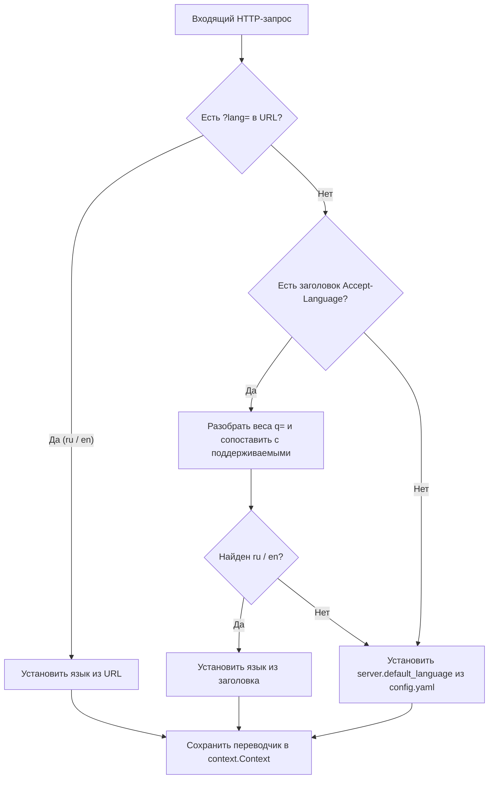

# ADR 15: Архитектура серверной интернационализации (Backend i18n)

**Дата:** 17 сентября 2026 г.  
**Статус:** Утверждено  
**Авторы:** Команда проекта «Боян» (Boyan)

---

## 1. Контекст и проблематика

Комплекс «Боян» (Boyan) построен по строгой Headless-архитектуре, при которой бэкенд на Go предоставляет REST API и каталоги OPDS v1.2 / v2.0, а интерфейсы пользователя (десктопный SPA и мобильный Touch PWA) работают независимо.

В то же время комплекс обслуживает широкий спектр **внешних клиентов**, которые не имеют собственных встроенных словарей интернационализации для «Бояна»:

1. **E-Ink и мобильные читалки по протоколам OPDS** (PocketBook, Onyx Boox, KOReader, Moon+ Reader, AlReaderX, Apple Books). Данные ридеры считывают XML/Atom или JSON-LD фиды и выводят названия разделов каталога (`<title>`, `<content>`) напрямую на экран пользователя. При наличии жестко зашитых русских строк англоязычные пользователи ридеров видят интерфейс каталога на русском языке.
2. **Сторонние утилиты и интеграции** (CLI-скрипты, плагины к Calibre, расширения браузеров, интеграции с домашней автоматизацией), которые напрямую выводят тело ошибки `{"error": "..."}`.
3. **Фронтенды SPA/PWA**, которые при возникновении непредвиденных или редких ошибок из бэкенда отображают сообщение из API в всплывающих уведомлениях.

Возникла необходимость предоставить централизованный, легковесный механизм мультиязычности на уровне самого бэкенда, не требующий внешних тяжелых зависимостей и сохраняющий высокую производительность Go.

---

## 2. Рассмотренные альтернативы

### Вариант 1: Исключительно клиентская локализация (Client-Only i18n)

* **Суть:** Бэкенд возвращает только технические коды ошибок (например, `{"code": "AUTH_INVALID_CREDENTIALS"}`), а все тексты хранятся во фронтендах в `vue-i18n`.
* **Недостатки:**
  * Полностью не решает проблему OPDS-каталогов: PocketBook и KOReader не умеют парсить коды ошибок и заменять их на переводы.
  * Внешние клиенты (curl, сторонние скрипты) будут отображать пользователю сухие машинные коды без внятных пояснений.
* **Вердикт:** Отклонено.

### Вариант 2: Тяжелый серверный фреймворк i18n (например, `nicksnyder/go-i18n` с TOML/YAML файлами)

* **Суть:** Использование сложного фреймворка с динамической подгрузкой файлов локализации.
* **Недостатки:**
  * Избыточная сложность и зависимость от внешних файлов конфигурации в runtime.
  * Накладные расходы на парсинг в памяти.
  * Риск рассинхронизации бинарного файла и файлов переводов при ручной установке на VPS / Linux.
* **Вердикт:** Отклонено.

### Вариант 3: Автономный легковесный модуль `internal/i18n` с гибридным форматом ответов (Выбранный вариант)

* **Суть:**
  * Реализация модуля `backend/internal/i18n` на базе типизированных Go-словарей, скомпилированных непосредственно в бинарный файл (`zero-external-files`).
  * Определение языка по прозрачному каскаду (Query-параметр `?lang=` $\rightarrow$ заголовок `Accept-Language` $\rightarrow$ конфиг сервера).
  * Гибридный формат ответов REST API: одновременно локализованная строка `error` и стабильный машинный `code`.
  * Динамическая подстановка локализованных строк во все OPDS-фиды v1.2 / v2.0 и OpenSearch дескриптор.
* **Преимущества:**
  * 100% совместимость со всеми типами клиентов («глупыми», умными SPA и E-Ink читалками).
  * Нулевой оверхед по памяти и ресурсам процессора (константные словари без аллокаций).
  * Удобство настройки ридеров: адрес `https://boyan.domain.com/opds/v1/feed.xml?lang=en` гарантирует английский интерфейс каталога на читалке.
* **Вердикт:** **Утверждено**.

---

## 3. Архитектурное решение

### 3.1. Каскадное определение языка клиента (Language Negotiation)

Язык запроса определяется последовательно:



1. **Query-параметр `?lang=...`**: позволяет зафиксировать язык каталога в URL (например, в PocketBook или KOReader).
2. **Заголовок `Accept-Language`**: стандартный заголовок браузеров и мобильных устройств (поддерживается разбор значений качества `q=0.9`).
3. **Конфигурация сервера**: параметр `server.default_language` в `config.yaml` (по умолчанию `"ru"`).

### 3.2. Гибридный контракт REST API

Все ошибки API возвращаются в унифицированном формате:

```json
{
  "error": "Неверное имя пользователя или пароль",
  "code": "AUTH_INVALID_CREDENTIALS"
}
```

* Поле `error` содержит текст на языке клиента.
* Поле `code` содержит неизменный код в SCREAMING_SNAKE_CASE для программной обработки.

### 3.3. Локализация OPDS v1.2 и v2.0

В фидах OPDS динамически переводятся:

* Корневые разделы («По авторам» / *«By Authors»*, «По сериям и циклам» / *«By Series»*, «По жанрам и категориям» / *«By Genres & Categories»*, «Новые поступления» / *«Recent Additions»*).
* Описания разделов («Поиск книг по алфавитному каталогу авторов» / *«Browse books by author alphabetical index»*).
* Заголовки экранов («Авторы по алфавиту» / *«Authors by Alphabet»*, «Книги автора» / *«Author's Books»*, «Серии по алфавиту» / *«Series by Alphabet»*).
* Описание OpenSearch 1.1 (`/opds/v1/opensearch.xml`).

---

## 4. Последствия и результаты

1. **Улучшение UX на E-Ink читалках:** пользователи с устройствами на английском языке или пользователи из других стран получают полностью переведенный каталог OPDS.
2. **Отказоустойчивость внешних интеграций:** сторонние скрипты и клиенты без локализации сразу отображают осмысленные сообщения об ошибках на понятном языке.
3. **Нулевое влияние на производительность:** словари встроены в бинарный файл, парсинг заголовка оптимизирован и выполняется за единицы наносекунд.
